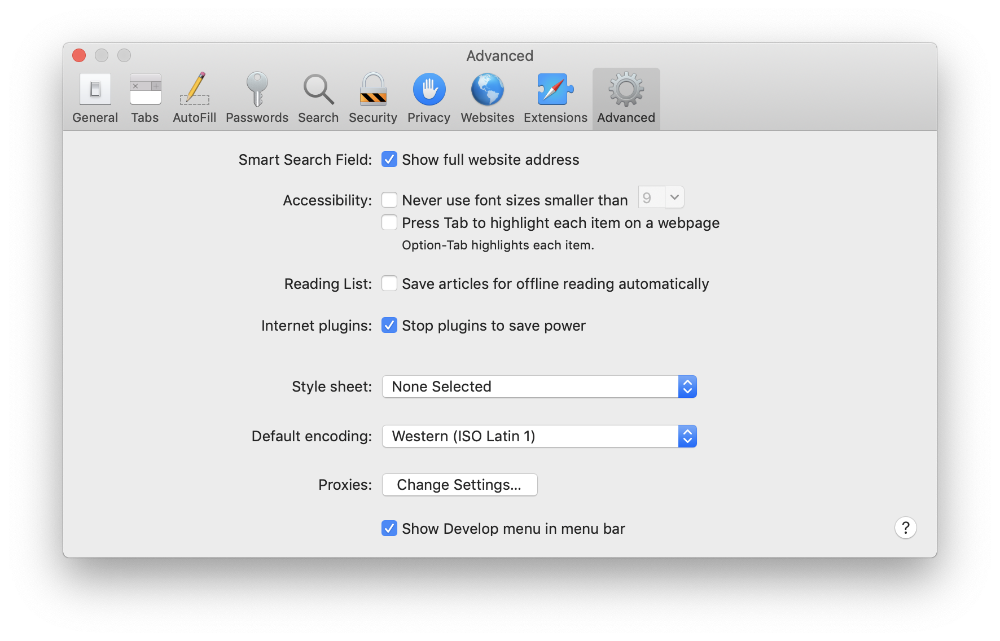
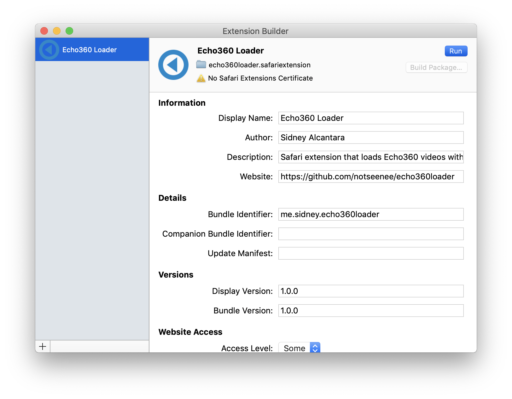

# Echo360 Loader for Safari 

## Installation instructions
1. Download this .safariextension folder

2. Open Safari Preferences. Go to the Advanced tab and tick “Show Develop menu
   in menu bar”
   
3. Open the Develop menu and click “Show Extension Builder”

4. Click “Continue” in the “Are you sure you want to use Safari Extension
   Builder?” popup.
   

5. On the bottom-left corner, click the + icon and click “Add Extension...”
   

6. Open the .safariextension folder

7. Click “Run” in the top-right corner
   

8. You can now close Extension Builder

## Changes
- hls.js and the `playHLS()` function in `contentScript.js` was removed since
  Safari can play HLS streams natively

- There is no toolbar icon since it is not required in Safari

- Both `redirect.js` and `contentScript.js` check `window.location.hostname`
  since you cannot set specific targets for injected scripts in Safari
  extensions

- `contentScript.js` checks `window.top === window` as it is recommended by
  Apple

- `redirect.js` no longer redirects to the non-HTTPS version of the iPad player
  since Safari allows non-HTTPS HLS streams to play in a HTTPS webpage

- `fixMetadata()` was renamed to `fixThumbnails()` as the metadata is shown by
  default since it is using the HTTPS version of the iPad player
